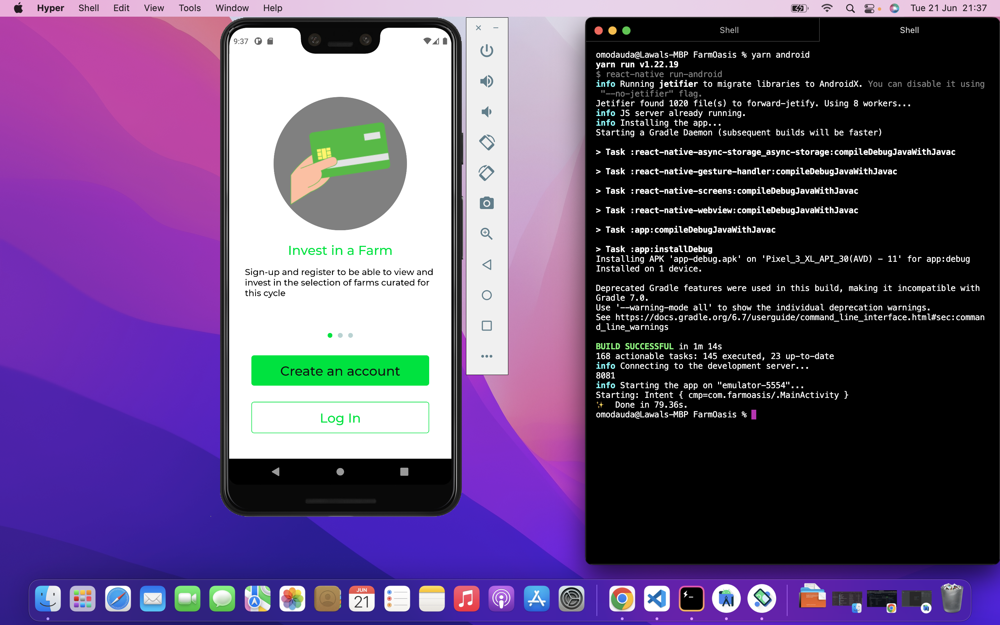

# Farm Oasis




FarmOasis is a product aiming to improve the income and productivity of smallholder farmers through crowdfunding. Users get to invest on farm projects
and get proceeds.

## Features

- Responsive design that works with android devices
- User authentication
- Investment management
- In-app payment

## Built With

- React Native
- Redux
- Paystack

## Live Demo

[Demo APK Link](https://drive.google.com/file/d/1Jx7XP9WgxyjF7PqybTGhfpwgFVrKAHWU/view)

## Getting Started

To get a local copy up and running follow these simple example steps.

### Prerequisites

- NodeJS - [v16.x](https://nodejs.org/en/)
- [Yarn](https://yarnpkg.com/)

### Setup

```bash
git clone https://github.com/omodauda/farm-oasis.git
cd ./farm-oasis
```

### Install

```bash
yarn
```

### Usage

```bash
yarn start
```

### Build

```bash
yarn android
```
